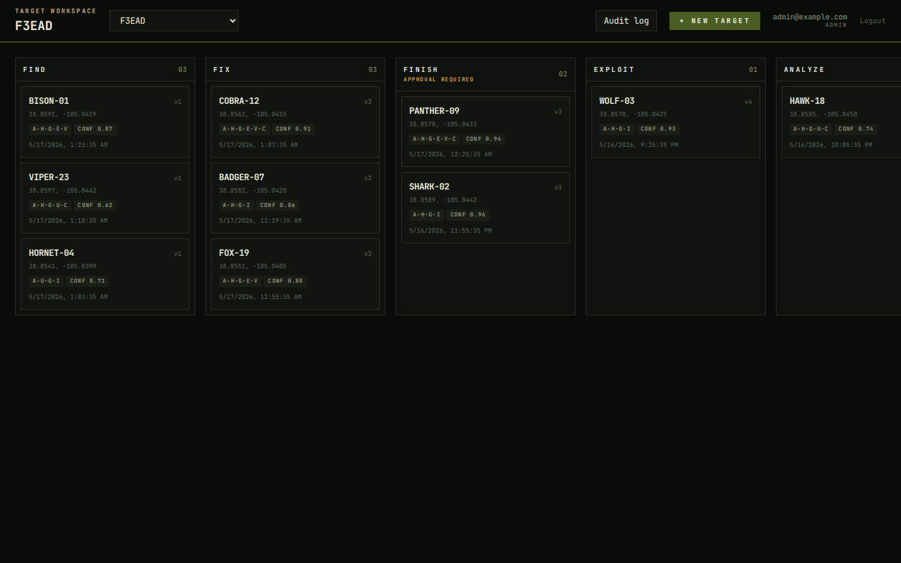

# Target Workspace

**A CoT-native, configurable kanban for the target lifecycle.** One engine; many domains. Ingest from any source (TAK / CoT, OSINT feeds, AI/ATR pipelines, manual entry), drive cards through a workspace-defined workflow with signed audit, publish to TAK Server or any CoT consumer.



## Why this exists

Operations cells already use kanban tools — Jira, Trello, sticky notes on a whiteboard. They use TAK consoles for situational awareness. **Neither connects to the other.** A card on the kanban has no relationship to the dot on the map; the dot on the map has no workflow. Target Workspace closes that loop: cards carry their CoT identity, the map glyphs *are* the cards, and presence (PLI) on the map can drive workflow transitions on the kanban with a signed audit chain attesting every move.

The same engine runs across four customer worlds — DoD tactical targeting, federal LE investigation, county SAR, disaster-relief EOC — by changing a YAML scenario, not the code. See [docs/SCENARIOS.md](docs/SCENARIOS.md).

## Quickstart

```bash
git clone https://github.com/joshuafuller-labs/target-workspace.git
cd target-workspace
docker compose -f docker/docker-compose.yml up -d --build
```

Then open <http://127.0.0.1:8000> and sign in with `admin@example.com` / `demopw`. Five demo boards seed on first boot (override via `TW_DEMO_SCENARIOS` in the compose file).

A production-shaped recipe with TLS + Postgres + persistent volumes is tracked in [GitHub Issues](https://github.com/joshuafuller-labs/target-workspace/issues).

## What's distinctive

- **Plugin families on `pip install`** — Source, Publisher, and Effector each discovered via `importlib.metadata.entry_points`. First-party adapters: GDELT, USGS, NWS, ACLED, synthetic ATR, CoT-in, TAK-server-out, raw-CoT, webhook-out, manual_effector. ([ADR 0005](docs/adr/0005-plugin-system-entry-points.md))
- **Signed audit chain** — every state change writes an append-only event signed by a per-instance ed25519 keypair. Federation reuses the signature path; chain-of-custody and FOIA response are queries, not reconstructions.
- **Presence-aware workflow** — PLI cache + geofence engine + workflow trigger rules. Cards can promote when assigned callsigns arrive on-scene.
- **Configurable without rebuild** — themes, board templates, workflow rules, classification schemes, all data-driven. Same binary serves hobbyist single-container and DoD-cluster deployments. ([ADR 0008](docs/adr/0008-malleability-principle.md))
- **API is the platform** — OpenAPI 3.1 contract; web SPA, native mobile, ATAK plugin, and curl one-liners are equal-class consumers. WebSocket realtime at `/v1/subscribe`, SSE fallback at `/v1/events`. ([ADR 0013](docs/adr/0013-api-client-agnostic.md))
- **Provenance-first** — every Target carries its source chain; multi-source observations fuse confidences via the independence rule; every transition records actor + justification + (where present) the geo-attestation that triggered it.

The [animated walkthrough](docs/demo/demo-walkthrough.mp4) is the fastest way to see what the SPA actually does.

## Documentation

| Topic | Doc |
|---|---|
| Demo scenarios + screenshots | [docs/SCENARIOS.md](docs/SCENARIOS.md) |
| Operating principles, project layout, plugin contracts | [docs/foundation.md](docs/foundation.md) |
| Pinned dependency manifest + license + CVE audit | [docs/tech-stack.md](docs/tech-stack.md) |
| Architecture decisions | [docs/adr/](docs/adr/) |
| MVP scope (what's in, what's deferred) | [docs/MVP_CUT_LIST.md](docs/MVP_CUT_LIST.md) |
| Customer-world research (DoD / federal LE / SAR / disaster) | [docs/research/SYNTHESIS.md](docs/research/SYNTHESIS.md) |
| Personas + journey maps + mockups (desktop + mobile) | [docs/personas/](docs/personas/), [docs/mockups/](docs/mockups/) |
| Soft conventions (hazard entity, classification) | [docs/conventions/](docs/conventions/) |
| Walkthrough video pipeline | [docs/demo/README.md](docs/demo/README.md) |
| Live roadmap | [GitHub Issues](https://github.com/joshuafuller-labs/target-workspace/issues) |

## Status

The backend and SPA are a substantial working prototype, but the operational tasking model still needs community testing and refinement. The roadmap and open questions live in [GitHub Issues](https://github.com/joshuafuller-labs/target-workspace/issues).

## License

Target Workspace is licensed under the [MIT License](LICENSE). Third-party dependency notices remain in [NOTICES.md](NOTICES.md).
