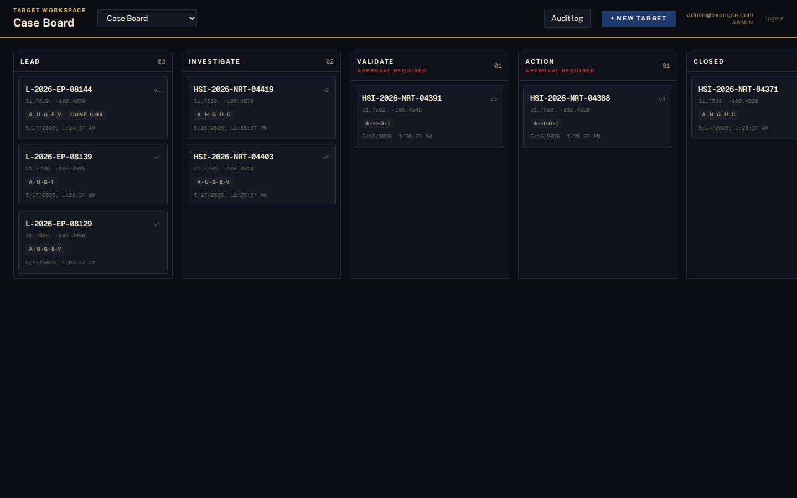
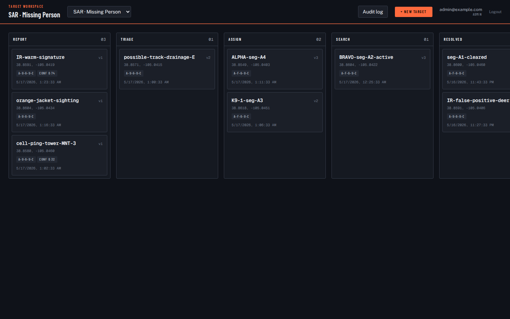
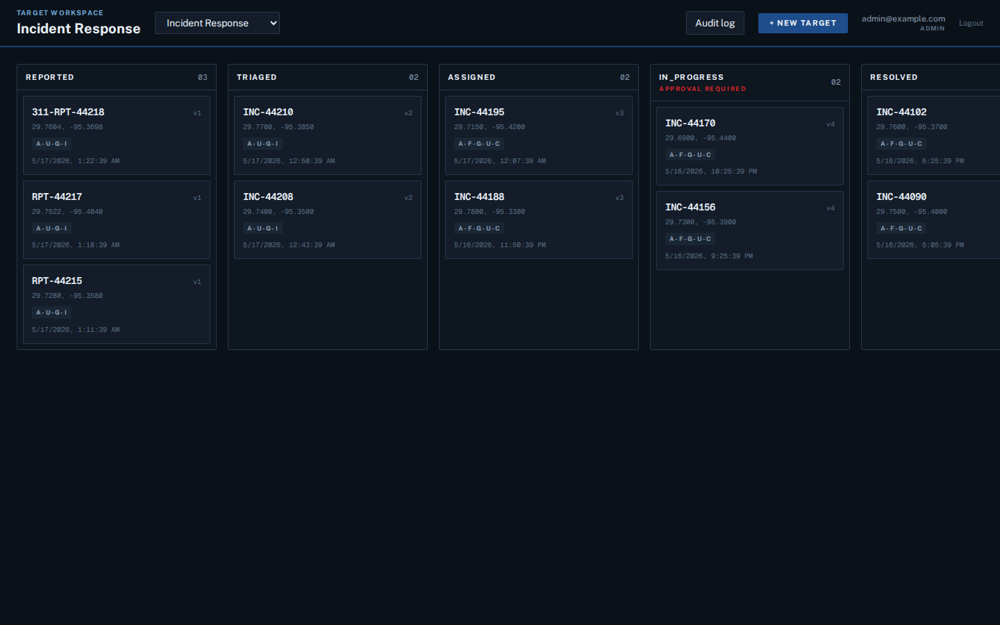

# Demo scenarios

Every bundled scenario is one YAML file under `src/target_workspace/demo/scenarios/`. Same engine, same database, same audit chain — only the board, the targets, the workflow stages, and the theme differ. Proof that [ADR 0008 — malleability](adr/0008-malleability-principle.md) is doing its job.

Switching boards in the SPA repaints the whole interface via CSS variables on the document root: different typeface, accents, atmospheric background. A single still frame is enough to tell which world you're looking at.

| Scenario | Board | Theme | Showcases |
|---|---|---|---|
| **tf-dagger-f3ead** | F3EAD (6 cols) | `tactical` — JetBrains Mono, olive + FDE, blueprint dot grid | DoD tactical targeting + Counter-UAS. 15 targets across Find → Fix → Finish → Exploit → Analyze → Disseminate. Mix of ground contacts (`a-h-G-*`) and small-UAS air contacts (`a-h-A`), including a Coyote-SRT kinetic intercept on a Shahed candidate and a defeated DJI quad with full BDA. **Demonstrates that C-UAS is not a separate workflow — it's F3EAD applied to air contacts.** |
| **le-counter-narco** | Case Board (5 cols) | `federal` — Public Sans, navy + federal gold | Federal LE counter-narcotics. Case numbers, AUSA names, warrant drafts, FOIA prep status. Lead → Investigate → Validate → Action → Closed. |
| **sar-missing-hiker** | SAR · Missing Person (5 cols) | `sar` — Barlow Condensed display + hi-vis orange, topographic contour atmosphere | County SAR. IR cues, sightings, cell pings flowing through Report → Triage → Assign → Search → Resolved with team assignments (ALPHA, BRAVO, K9-1, AIR-1). |
| **disaster-relief-hurricane** | Incident Response (5 cols) | `ics` — Public Sans, operational blue + warning red, EOC grid lines | County EOC hurricane response. ICS sections + ESF tags through Reported → Triaged → Assigned → In-Progress (approval-gated) → Resolved. |
| **disaster-kerr-flood** | Incident Response · Op Period 1 (5 cols) | `ics` | Flash-flood incident based on the July 2025 Kerr County floods. Welfare-check duplicates that get reconciled, hazard rows (flooded crossings, debris), multi-team SAR convergence. Anchors the [walkthrough video](demo/README.md). |
| **osint-cross-correlation** | OSINT Correlation · Op Period 1 (4 cols) | `ics` | OSINT plugin family exercise — GDELT events, USGS earthquakes, NWS flood-warning polygons, RSS+NER-extracted news, all cross-correlating on the same lat/lon. Includes a negative-evidence row (USGS clean → not seismic). |
| **tf-dagger-f3ead** ATAK demo (when re-seeded) | F3EAD | `tactical` | Live PLI binding — assigned callsigns moving across the map; geofence arrivals auto-promote cards through the workflow (post-`tw-d3t9`). |

<table>
  <tr>
    <td><br/><sub>DoD Tactical · F3EAD</sub></td>
    <td><br/><sub>Federal LE · Case Board</sub></td>
  </tr>
  <tr>
    <td><br/><sub>SAR · Missing Person</sub></td>
    <td><br/><sub>Disaster Relief · Incident Response</sub></td>
  </tr>
</table>

## Seeding scenarios

```bash
TW_DEMO_SCENARIOS='tf-dagger-f3ead,le-counter-narco,sar-missing-hiker,disaster-relief-hurricane,disaster-kerr-flood,osint-cross-correlation'
```

The seed loader is idempotent — already-seeded boards are not re-seeded. To wipe and re-seed in dev, drop the SQLite file (or the Postgres volume) and restart.

## Authoring a new scenario

1. Drop a YAML file under `src/target_workspace/demo/scenarios/<id>.yaml`.
2. Top-level keys: `name`, `workspace_name`, `board` (with `columns`), `targets` (each with `column_name`, `cot_type`, `lat`, `lon`, `minutes_ago`, optional `custom_fields`, optional `transitions`).
3. `entity_kind: "hazard"` in `custom_fields` paints the card + map in warning red (see [docs/conventions/hazard-entity.md](conventions/hazard-entity.md)).
4. Boot with `TW_DEMO_SCENARIOS=<id>,…` — the loader picks it up via the standard discovery path.

See `disaster-kerr-flood.yaml` for the most feature-rich worked example.
